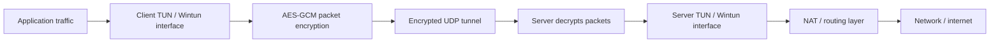

# VPN From Scratch

<div align="center">

**An educational VPN prototype built from first principles with virtual network interfaces, encrypted UDP tunnelling, X25519 key exchange, and AES-GCM packet encryption.**

[Architecture](docs/ARCHITECTURE.md) | [Security Notes](docs/SECURITY.md) | [Run Locally](#run-locally) | [License](#license)

</div>

> **Status:** research and learning prototype. This is not a production VPN, privacy product, or anonymity tool.

## Overview

VPN From Scratch explores how a VPN works internally by implementing the core pieces directly in Python instead of wrapping an existing VPN framework. The project creates virtual network interfaces, performs session setup, derives encryption keys, encrypts tunnel packets, and transports them over UDP between a client and server.

The goal is to make VPN architecture understandable at the systems level: virtual interfaces, packet capture, key exchange, authenticated encryption, UDP transport, routing, and server identity verification.

## Why This Matters

Most VPNs hide the interesting engineering behind polished clients and production infrastructure. This project exposes the machinery: how packets enter a virtual interface, how a secure session is negotiated, how tunnel traffic is encrypted, and how the server receives and forwards traffic.

It is useful as a systems/security project because it connects networking, applied cryptography, OS interfaces, and routing into one working prototype.

## Capability Snapshot

| Layer | Current implementation |
| --- | --- |
| Client | Python client with Wintun-oriented interface code and a Tkinter UI |
| Server | Python server path with TUN/Wintun concepts and routing/NAT hooks |
| Handshake | TCP setup using protocol version, timestamp, X25519 public keys, HKDF salt, and encrypted confirmation |
| Tunnel | UDP transport for encrypted packet flow |
| Cryptography | X25519 key agreement, HKDF-derived session keys, AES-256-GCM packet encryption |
| Identity | Server public-key pinning by default, with explicit insecure local-test mode |
| Config | JSON example configs committed; runtime configs and private keys ignored |
| Testing | Crypto, handshake, tunnel-flow, and loopback-oriented test scripts |

## Architecture



The client captures packets from a virtual network interface, encrypts them, and sends them to the server over UDP. The server decrypts each packet and forwards it into its own virtual-interface and routing path.

See [docs/ARCHITECTURE.md](docs/ARCHITECTURE.md) for the deeper module-level breakdown.

## Handshake Model

The project uses a TCP handshake before switching to UDP tunnel transport:

```text
1. ClientHello
   - protocol version
   - Unix timestamp
   - client X25519 public key

2. ServerHello
   - server X25519 public key
   - HKDF salt / nonce

3. ClientAck
   - encrypted confirmation message

4. UDP tunnel starts
   - both sides use derived directional session keys
```

Server public-key pinning is used so the client does not silently accept an unknown server identity.

## Cryptographic Model

| Component | Purpose |
| --- | --- |
| X25519 | Ephemeral key agreement |
| HKDF | Session-key derivation from the shared secret |
| AES-256-GCM | Authenticated packet encryption |
| Random 96-bit nonces | Per-packet encryption nonces |
| Directional keys | Separate client-to-server and server-to-client session keys |

This is an educational cryptographic structure and has not been externally audited. See [docs/SECURITY.md](docs/SECURITY.md) for the security boundary and limitations.

## Run Locally

Install dependencies:

```bash
pip install -r requirements.txt
```

Copy example configs:

```bash
cp config/server.example.json config/server.json
cp config/servers.example.json config/servers.json
```

On Windows PowerShell:

```powershell
Copy-Item config\server.example.json config\server.json
Copy-Item config\servers.example.json config\servers.json
```

Download Wintun for Windows from:

```text
https://www.wintun.net/
```

Place the local DLL at:

```text
wintun/wintun.dll
```

The DLL is not committed to this repository.

## Usage

Run the server:

```bash
python vpn.py server
```

Run the client UI:

```bash
python vpn.py client
```

Run built-in tests:

```bash
python vpn.py test
```

Run the loopback integration script:

```bash
python test_vpn_loopback.py
```

Administrative privileges may be required for virtual interface creation, Wintun access, route changes, and NAT configuration.

## Testing And Validation

The current project includes checks for:

- AES-GCM encryption and decryption
- X25519 key agreement
- Handshake behaviour
- Tunnel packet flow
- Local loopback behaviour

Syntax validation:

```bash
python -m compileall .
```

## Repository Structure

```text
vpn-project/
|-- client/
|   |-- crypto.py          # Key exchange, encryption helpers
|   |-- handshake.py       # Client/server handshake flow
|   |-- tunnel.py          # Encrypted tunnel transport logic
|   `-- wintun.py          # Wintun interface wrapper
|-- server/
|   |-- main.py            # Server entrypoint
|   `-- nat.py             # NAT/routing helpers
|-- ui/
|   `-- main.py            # Tkinter client UI
|-- config/
|   |-- server.example.json
|   `-- servers.example.json
|-- docs/
|   |-- ARCHITECTURE.md
|   `-- SECURITY.md
|-- wintun/
|   `-- README.md
|-- vpn.py                 # Main command entrypoint
|-- test_tun.py
|-- test_vpn_loopback.py
`-- requirements.txt
```

## Limitations

This project is not production-ready. Known limitations include:

- no external security audit
- no formal UDP replay-protection window
- no production-grade kill switch
- no mature route-leak protection
- platform-dependent NAT and routing behaviour
- limited hostile-network error handling
- no mature multi-client session management
- no installer, service manager, or automatic update flow
- no throughput optimisation for high-volume traffic

For real-world VPN use, use a mature and reviewed implementation such as WireGuard, OpenVPN, or an operating-system maintained IPsec stack.

## Roadmap

- Add a formal UDP replay window
- Improve route setup and teardown across Windows and Linux
- Add structured logging and diagnostics
- Add integration tests that avoid privileged interfaces where possible
- Improve multi-client server handling
- Add a stronger kill-switch design
- Add UI screenshots and packet-flow diagrams
- Package the repo as a clean educational systems lab

## License

Apache License 2.0. See [LICENSE](LICENSE).
